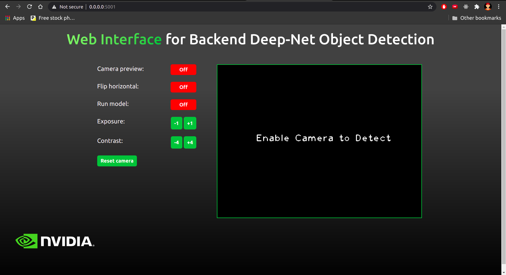

# Real-time object detection application

Web application for _real-time_ object detection on video streaming via web browser.



## Download model

To download the `yolov3.weights`, just run:

```bash
$ cd models/
$ python dl-weights.py
```

## To run application (without using Docker)

Create and activate an virtual environment, as follows:

```bash
$ cd cloned/directory/
$ python3 -m venv env
$ source env/bin/activate
```

After have installed and activated the environment, install all the dependencies:

```bash
$ pip3 install -r requirements.txt
```

After that, you can run the _following command_ and access the application at [127.0.0.1:5000](http://127.0.0.1:5000/) on your browser.

```bash
$ python application.py
```

## To run application (using Docker)

#### Make sure you have [Docker engine](https://docs.docker.com/engine/install/) installed on your system before proceeding.

Go to project directory:

```bash
$ cd cloned/directory/
```

In the project directory, build Docker image using `Dockerfile` of the project:

```bash
$ docker build -t web_app:latest .
```

After successful build of Docker image, you now can create and run a Docker container of the image:

```bash
$ docker run --privileged -p 5001:5001 web_app
```

### Now you should be able to access the application at [0.0.0.0:5001](http://0.0.0.1:5001/) port from your browser

To stop the application, first get `CONTAINER_ID` of the running Docker container:

```bash
$ docker ps
```

After getting the `CONTAINER_ID`, use the following command to stop the container:

```bash
$ docker stop <CONTAINER_ID>
```

*obs.: This application was tested only on *Google Chrome*.*

## Usage

- **Camera preview**: Enables and disables the webcam preview.
- **Run detection model**: Enables and disables the detection model.
- **Exposure**: Buttons which increase or decrease camera exposure stops by 1.
- **Contrast**: Buttons which increase or decrease camera contrast stops by 4.
- **Reset camera**: Reset all camera settings based on _camera_settings.log_ file.
